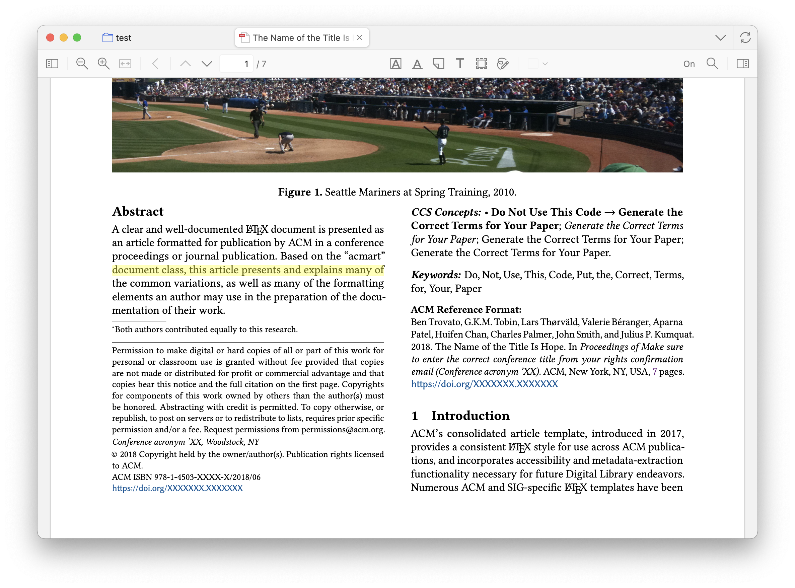

# 👀 Line Focus for Zotero

Read PDFs line by line in Zotero with a movable highlight.

## Overview

Adds a reading ruler to Zotero’s PDF reader: highlights the current text line, moves with W/S, and snaps to clicks.

## Example

Yellow highlight in the left column marks the focused line.

## Features

- Toolbar toggle
- Precise line highlight (pdf.js textLayer)
- Keyboard: `w` - up, `s` - down
- Click to move; auto-scroll across pages
- Configurable color (Preferences)

## Installation

- From Releases (recommended): Download the latest .xpi, then Tools > Add-ons > gear > Install Add-on From File. Restart if prompted.
- From source: Node.js ≥ 18. Build the XPI and install in Zotero.

## Usage

- Open a PDF and toggle Line Focus on the reader toolbar.
- Press `s` to move down, `w` to move up.
- Click any text line to jump the ruler.

## Changelog

- v0.2.0: Keyboard line highlighting
- v0.1.0: Initial release (reading ruler, color preference)

## License

AGPL-3.0-or-later. See LICENSE.
